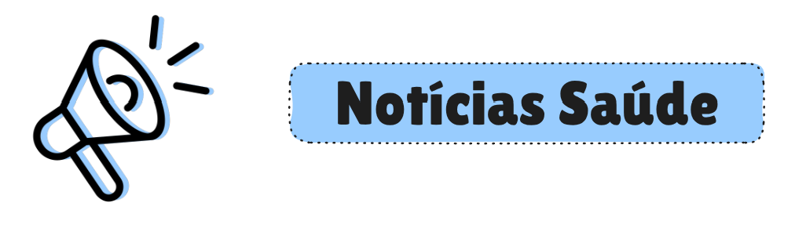
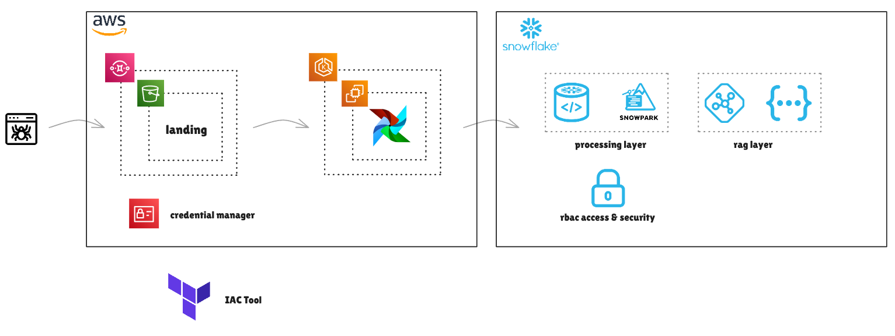
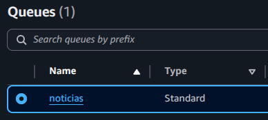
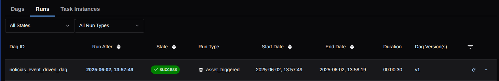
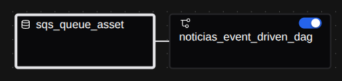
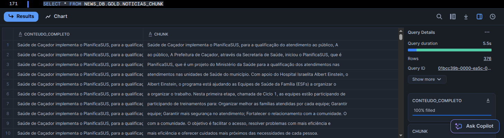
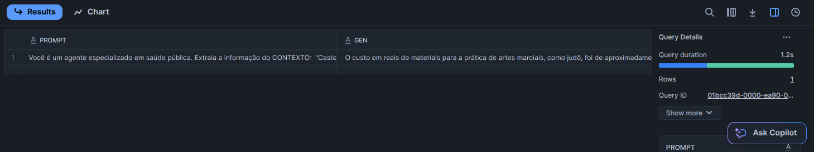

# 📰 | Plataforma de Notícias de Saúde

---

*"Solução Event Driven com Airflow e aplicação de Rag com Snowflake"*.

<h2>Sumário</h2>

- [0. Problema de Negócio](#0-problema-de-negócio)
- [1. Estratégia de Solução](#1-estratégia-de-solução)
- [2. Ingestão de Dados](#2-ingestão-de-dados)
  - [2.1. Scraping de Notícias](#21-scraping-de-notícias)
  - [2.2. Event Driven Dag](#22-Event-Driven-Dag) 
- [3. Processamento de Dados](#3-processamento-de-dados)
- [4. Rag com Snowflake](#4-rag-com-snowflake)

<h2>0. Problema de Negócio</h2>

O principal problema enfrentado atualmente é a falta de acesso confiável a eventos realizados em relação a saúde pública no Brasil, muitas famílias se é que sabem que esta tendo algum evento de conscientização, vacinação ou qualquer outro meio ou solução proposta pelo sistema de saúde da cidade em sua vizinhança devido a falta de tempo ou demais características que impedem essas famílias de obter essas informações de maneira fácil e simples.   

O geógrafo brasileiro Milton Santos, descreve em seu célebre texto "As Cidadanias Mutiladas" que a democracia somente é efetiva quando atinge todo o corpo social, isto é, quando os direitos são desfrutados por todos os cidadãos. Todavia, no contexto atual brasileiro, diante dos desafios ao acesso a uma plataforma de noticias de saúde pública, distanciam a população de direitos a notícias que todos deveriam ter acesso de uma forma simples e eficiente. Neste contexto, faz-se necessário a solução dos desafios para implementar uma plataforma de notícias de saúde pública que seja acessível a todos os brasileiros.

Em primeiro lugar vale a pena ressaltar a desinformação populacional como um dos principais fatores que corroboram para a persistência do problema no que tange o tema plataforma de saúde pública Brasil. Durante a formalização do atual plano educacional proposto na era Vargas no século XX é possível observer a falta de conteúdo na ementa envolvendo temas transversais, como a saúde, direitos e tecnologia. Nesta perspectiva, muitos brasileiros não conhecem os seus direitos relacionados a saúde pública e não possuem experiência para utilizar ferramentas tecnológicas para encontrar informações relevantes sobre notícias desta temática. Diante disso, muitas pessoas não possuem os insumos necessários e precisam de uma plataforma de nóticias confiável para consultar no dia a dia.    

<h2>1. Estratégia de Solução</h2>

O projeto teve início com uma etapa de imersão no problema de negócios, buscando compreender os desafios e as necessidades dos usuários finais. A partir desse entendimento, foi realizado um planejamento detalhado das atividades que orientariam o desenvolvimento da solução. A solução proposta é baseada em uma arquitetura orientada a eventos (Event-Driven Architecture) e com essa arquitetura seu principal objetivo é facilitar o acesso a informações críticas na área de Saúde das cidades de santa catarina, inicialmente com amostras dacidade de Caçador.
Como as novas publicações de notícias de saúde em fontes oficiais de dados (por exemplo, SUS, portais do governo, entre outros) são gerados em tempos intermitentes é necessário metodologias por meio de um fluxo moderno e eficiente de ingestão e processamento de dados. Além disso a disponibilização desses dados a os usuários finais deve ser por meio de linguagem natural.

- Geração de eventos: Notícias e atualizações são publicadas periodicamente por fontes oficiais.
- Ingestão de dados: Esses eventos são capturados de forma assíncrona por mecanismos Event-Driven.
- Processamento: Os dados são tratados dentro de uma arquitetura moderna de Engenharia de Dados em camadas de consumo (Lakehouse), que combina as vantagens dos data warehouses com a flexibilidade dos data lakes.
- Utilização de técnicas de RAG (Retrieval-Augmented Generation): Interface em linguagem natural, que permite a usuários com pouco ou nenhum conhecimento técnico acessar e interpretar os dados com facilidade.
- Workflow: Automação e escalabilidade no fluxo de dados.
- Inclusão Digital: Acessibilidade da informação para públicos diversos.
- Confiabilidade: Velocidade na tomada de decisão, com dados sempre atualizados.

Toda a solução de infraestrutura foi desenvolvida com Terraform integrado a AWS + Snowflake, além disso com a utilização do Python, Airflow, DBT e Snowflake Warehouse para as ferramentas de processamento, orquestração e documentação, por fim o Snowflake Cortex Service para a camada de PLN, VectorDB e RAG com Langchain e SQL. 

<h2>2. Ingestão de Dados</h2>

<h3>2.1. Scraping de Notícias</h3>

A primeira etapa da solução foi o desenvolvimento dos `crawlers`, isto é, o desenvolvimento das aplicações responsáveis pela raspagem dos dados de sites de notícias, a principal fonte de dados utilizada foi o site de notícias da Secretaria de Saúde da cidade de Caçador, Santa Catarina, esse site é um portal de notícias relacionadas a Saúde Pública que são pertinentes a toda a população da cidade de Caçador.

Como este projeto está totalmente público, sem fins lucrativos e relacionado a estudos, optei em utilizar o site de Caçador inicialmente para os primeiros testes, além disso o site possui o robotx.txt limitando alguns endpoints que não estou raspando, então o projeto não infringe nenhuma regra do site até o momento em que esse projeto foi desenvolvido.

Os `crawlers` são executados em tempos intermitentes, ou seja, apareceu uma notícia nova, em algum momento o crawler vai ser executado e coletar essa notícia e armazenar o texto bruto e outros metadados em arquivos no armazenamento de arquivos da Aws, esse armazenamento foi nomeado de Data Lake e esses arquivos são particionados por data na primeira camada do Data Lake chamada de Landing.

Quando um novo arquivo chega nesta camada landing, é disparado um indicativo por meio do `AWS SQS` para a próxima ferramenta da arquitetura, o `Airflow`.

<h3>2.2. Event Driven Dag</h3>

O `Airflow` vai ficar aguardando alguma nova mensagem recebida por meio do AWS SQS, caso o `Airflow` receba essa nova mensagem ele vai ser executado e orquestrar o workflow e subsequentemente a respectiva dag com as devidas tasks.

Essa funcionalidade desbloqueia um pipeline baseado em eventos, ou seja, a cada nova notícia é executado o `Airflow`, o `airflow` é a ferramenta responsável por executar o projeto DBT que por sua vez vai fazer a atualização das tabelas no Snowflake.

<h2>3. Processamento de Dados</h2>

A camada de processamento dos dados é a segunda etapa da solução.

Quando o `Airflow` é executado, o mesmo dispara consultas SQL por meio do DBT, em outras palavras, o `Airflow` vai executar consultas SQL, chamadas de funções e execução de procedures na plataforma do Snowflake por meio de um Compute Warehouse.

Os dados dentro da plataforma do Snowflake são nomeados de objetos, esses objetos possuem uma forte política de controle de acesso e também toda a infraestrutura do Snowflake foi levantada por meio do Terraform com módulos que já estão em preview no terraform atualmente.

Esses objetos dentro do Snowflake, alguns deles são tabelas, essas tabelas seguem a modelagem de Lakehouse, as tabelas são organizadas em camadas, Bronze, Silver e Gold.

- Bronze: Os dados são coletados e escritos de forma histórica nesta tabela, particionado por data, essa escrita é realizada por meio de um Python Procedure.
- Silver: Os dados da camada bronze são então processados e atualizados em tabelas "silvers".
- Gold: Os dados já limpos da camada silver são então agregados em visões analíticas ou enviesadas para alguma faceta de negócio.

Seguindo a perspectiva anterior, a tabela Gold utilizada no `Cortex Service`, ou seja, a tabela enviesada para o negócio utilizar como Vector Database esta na camada Gold, é uma tabela processada onde as notícias são quebradas em chunks para a recuperação depois, conforme ilustra a imagem abaixo.

<h2>4. Rag com Snowflake</h2>

A última etapa do projeto é justamente a elaboração da plataforma de notícias de saúde, para isso foi utilizado o `Cortex Service` do Snowflake, infelizmente essa solução ainda esta em testes no terraform, então ela foi levantada manualmente utilizando o Snowsight.

A solução do `Cortex Service` permite ao usuário selecionaer um LLM para ser a ferramenta de geração de embeddings que já esta integrada a tabelas da camada Gold, isto é, o proprio `Cortex Service` faz a atualização dos embeddings e nos permite disparar perguntas utilizando linguagem natural facilitando a busca e pesquisa de notícias de saúde pública da cidade de Caçador, Santa Catarina.

Por exemplo, considere a seguinte pergunta enviada ao `Cortex Service`: "Qual foi o custo em reais de materiais para a prática de artes marciais ?".

A coluna GEN da imagem abaixo nada mais é que a resposta da pergunta utilizando pesquisa vetorial e a geração de texto do LLM selecionado dentro da plataforma do `Cortex Service` do Snowflake.

Dessa forma é possível pessoas leigas realizarem perguntas relacionados a temática de saúde dentro da plataforma e obterem as devidas respostas. 

